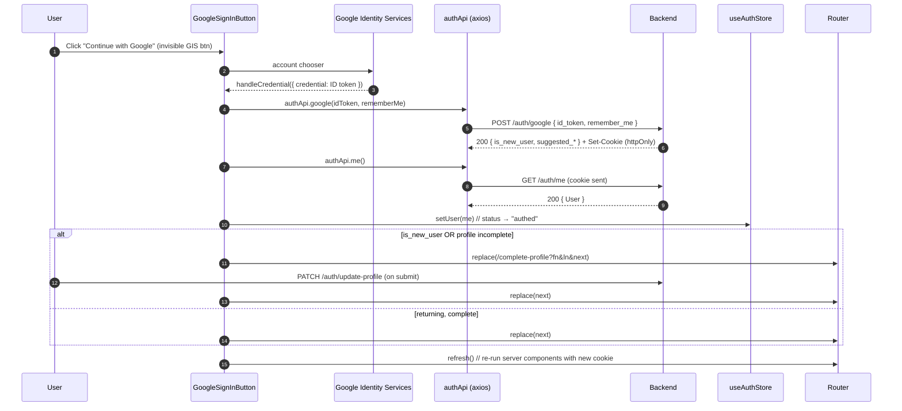
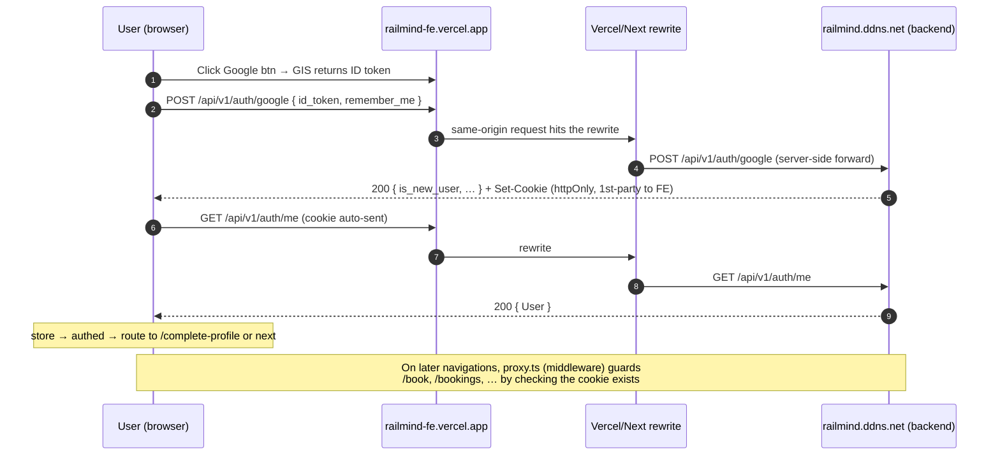

# Google Sign-In — Frontend Flow

> How "Continue with Google" works in the RailMind web app: every endpoint that
> fires, which hooks/stores are involved, and the exact FE logic from button
> click → authenticated session → routing.

---

## TL;DR

1. User clicks our custom **"Continue with Google"** button. (It's actually
   Google's official GIS button rendered invisibly on top — see [the overlay
   trick](#why-the-invisible-google-button).)
2. Google Identity Services (GIS) returns a one-time **ID token** (`credential`,
   a JWT) to our callback.
3. We exchange it: **`POST /auth/google`** → backend validates the token, sets
   **httpOnly session cookies**, and returns `{ is_new_user, suggested_first_name, … }`.
4. We fetch the canonical profile: **`GET /auth/me`** → seed the Zustand auth store.
5. **Route by real completeness:** new user or incomplete profile →
   `/complete-profile`; otherwise → the `next` destination.

No tokens are stored in JS — the session lives entirely in httpOnly cookies the
browser sends automatically (`withCredentials` is on the axios client).

---

## Endpoints called

| #   | Endpoint                     | When                                                       | Sent                        | Returns (FE-relevant)                                                                                          |
| --- | ---------------------------- | ---------------------------------------------------------- | --------------------------- | -------------------------------------------------------------------------------------------------------------- |
| 1   | `POST /auth/google`          | Right after GIS hands us the credential                    | `{ id_token, remember_me }` | `data: { is_new_user, suggested_first_name, suggested_last_name, username, email }` + **Set-Cookie** (session) |
| 2   | `GET /auth/me`               | Immediately after #1 succeeds                              | — (cookie)                  | `data: User` (canonical profile)                                                                               |
| 3   | `PATCH /auth/update-profile` | Only if routed to `/complete-profile` and the user submits | profile fields              | `data: ProfileDetails` (fresh profile)                                                                         |
| 4   | `GET /auth/me`               | After #3, to refresh the store (incl. `profile_photo`)     | — (cookie)                  | `data: User`                                                                                                   |

> The advisor/Google call **always sends the cookie** automatically. There is no
> Authorization header and no CSRF token on these calls.

---

## Cast of files

| Concern                                                                             | File                                                                                                     |
| ----------------------------------------------------------------------------------- | -------------------------------------------------------------------------------------------------------- |
| The button + GIS integration + credential callback + routing                        | [components/auth/GoogleSignInButton.tsx](../components/auth/GoogleSignInButton.tsx)                      |
| API layer (`authApi.google`, `.me`, `.logout`, …) + `User`/`GoogleAuthResult` types | [lib/auth.ts](../lib/auth.ts)                                                                            |
| Shared axios client (`withCredentials`, 401 redirect, retry)                        | [lib/api.ts](../lib/api.ts)                                                                              |
| Client auth state (Zustand)                                                         | [store/auth.ts](../store/auth.ts)                                                                        |
| Session bootstrap on every page load                                                | [components/providers/AuthProvider.tsx](../components/providers/AuthProvider.tsx)                        |
| Reads the auth cookie server-side → `initialAuthed`                                 | [app/layout.tsx](../app/layout.tsx)                                                                      |
| Login page (hosts the button, "Remember me", already-authed redirect)               | [app/(auth)/login/page.tsx](<../app/(auth)/login/page.tsx>)                                              |
| New-user onboarding (where Google sign-ups land)                                    | [app/complete-profile/page.tsx](../app/complete-profile/page.tsx)                                        |
| Profile read/update hooks                                                           | [hooks/useProfile.ts](../hooks/useProfile.ts), [hooks/useUpdateProfile.ts](../hooks/useUpdateProfile.ts) |
| **Route-guard middleware** (redirects signed-out users off protected paths)         | [proxy.ts](../proxy.ts)                                                                                  |
| **API proxy** (rewrites `/api/*` → backend) — Node/`next start`                     | [next.config.ts](../next.config.ts)                                                                      |
| **API proxy** — Vercel platform layer                                               | [vercel.json](../vercel.json)                                                                            |

### Env / config

| Var                            | Default                     | Use                                                                                                           |
| ------------------------------ | --------------------------- | ------------------------------------------------------------------------------------------------------------- |
| `NEXT_PUBLIC_GOOGLE_CLIENT_ID` | — (required)                | GIS client id; if missing the button renders **disabled**                                                     |
| `NEXT_PUBLIC_API_URL`          | `/api/v1`                   | axios base URL — **leave unset in prod** so calls stay same-origin (see [Deployment](#deployment--prod-flow)) |
| `NEXT_PUBLIC_AUTH_COOKIE_NAME` | `access_token`              | which cookie the server layout + middleware check                                                             |
| `API_PROXY_TARGET`             | `https://railmind.ddns.net` | **server-only** — where `/api/*` is rewritten (the real backend origin)                                       |

---

## The full flow, step by step

### 0. Page setup

- [`app/(auth)/login/page.tsx`](<../app/(auth)/login/page.tsx>) renders
  `<GoogleSignInButton next={nextPath} onError={setSubmitError} highlight={highlightGoogle} rememberMe={rememberMe} />`.
  - `nextPath` = `?next=` query param (where to go after login), default `/`.
  - `rememberMe` mirrors the page's "Remember me" checkbox.
- If the user is **already** authenticated (`authStatus === "authed"`), the page
  redirects to `nextPath` immediately — the check uses validated store state,
  **not** the raw cookie, because the cookie is httpOnly and could be stale.

### 1. Loading GIS

`GoogleSignInButton` injects Google's script via Next's `<Script src="https://accounts.google.com/gsi/client" strategy="afterInteractive">`.

Because the script may already be cached (e.g. navigating `/login ↔ /register`),
`scriptReady` is **seeded synchronously** from `window.google?.accounts?.id` and
also set via `onReady`/`onLoad`. This avoids a dead button when the callbacks
don't fire on a warm load.

### 2. Initialising + rendering the (invisible) Google button

Once ready, an effect runs:

```ts
google.accounts.id.initialize({ client_id: CLIENT_ID, callback: handleCredential });
google.accounts.id.renderButton(overlayEl, { theme: "filled_black", width, … });
```

A `ResizeObserver` re-renders the GIS button whenever our visual button changes
width (GIS needs a fixed pixel width, clamped to 240–400px).

#### Why the invisible Google button?

GIS only emits the ID-token `credential` from **its own** rendered button (or One
Tap) — a fully custom `<button>` can't trigger it. So we use **Option B**: render
Google's real button at `opacity: 0`, absolutely positioned over our styled dark
button. The user sees ours; their click lands on Google's. No dead zones.

### 3. The credential callback — `handleCredential`

When the user picks a Google account, GIS calls `handleCredential(response)`:

```text
response.credential  ──►  the Google ID token (JWT), one-time use
```

1. **No credential?** → call `onError("Google sign-in failed…")` and stop.
2. `setLoading(true)` → shows the spinner overlay on the button.
3. **Exchange the token** (endpoint #1):
   ```ts
   const result = await authApi.google(credential, rememberMeRef.current);
   // → POST /auth/google { id_token, remember_me }
   ```
   On success the **backend sets the httpOnly session cookies** on the response;
   `result` only carries routing hints (`is_new_user`, `suggested_*`).
4. **Fetch the canonical profile** (endpoint #2):
   ```ts
   const me = await authApi.me(); // GET /auth/me
   setUser(me); // store → status: "authed"
   ```
   If `/auth/me` throws, we `setUser(null)` and fall through to onboarding.
5. **Decide where to go** (see next section).
6. `router.refresh()` to re-run server components with the new cookie.
7. **On any thrown error:** `toApiError(err)` → `googleErrorMessage(code)` →
   `onError(message)` (surfaces in the login page's error UI).
8. `finally` → `setLoading(false)`.

> Props (`next`, `onError`, `rememberMe`) are kept in **refs** so prop changes
> don't re-initialise GIS — only `scriptReady`/`handleCredential` drive the setup
> effect.

### 4. Routing decision (new vs returning, complete vs incomplete)

We route on **real profile completeness**, not just `is_new_user` — this also
catches users who signed up earlier but abandoned onboarding:

```ts
const incomplete = !me || !me.gender || !me.marital_status || !me.first_name;

if (result.is_new_user || incomplete) {
  // → /complete-profile?fn=<suggested first>&ln=<suggested last>&next=<next>
  router.replace(`/complete-profile?${qs}`);
} else {
  router.replace(next); // straight into the app
}
```

- `fn`/`ln` prefill the onboarding form from Google's suggested names (still
  editable).
- `next` is forwarded so the user lands where they originally intended after
  finishing onboarding.

### 5. Onboarding finalisation (`/complete-profile`)

For new/incomplete users, [app/complete-profile/page.tsx](../app/complete-profile/page.tsx):

- Reads `fn`/`ln`/`next` from the query; loads any existing profile via
  `useProfile()` (cached `GET /auth/me`).
- On submit → `useUpdateProfile()` → **`PATCH /auth/update-profile`** (endpoint #3).
- Then re-fetches `authApi.me()` (endpoint #4) and `setUser(freshUser)` so the
  store has the complete profile (including `profile_photo`).
- `router.replace(nextPath)` → done.

---

## Sequence diagram



---

## State & hooks involved

### Zustand auth store — [store/auth.ts](../store/auth.ts)

```ts
status: "loading" | "authed" | "guest"
setUser(user) → set({ user, status: user ? "authed" : "guest" })
```

- `setUser(me)` after Google login flips status to `"authed"`, which every
  `useAuthStore((s) => s.status)` consumer reacts to (navbar, guards, the
  login-page auto-redirect, the fare-advisor `enabled` gates, etc.).
- This is **client UI/auth state only**. Server data (profile, bookings) lives
  in TanStack Query.

### Session bootstrap on reload — [AuthProvider](../components/providers/AuthProvider.tsx) + [layout](../app/layout.tsx)

This is how the session survives a full page reload (cookies persist, JS state
doesn't):

1. **Server**: `app/layout.tsx` reads the auth cookie with `next/headers`
   `cookies()` → `initialAuthed = Boolean(cookie)`.
2. **Client**: `AuthProvider` receives `initialAuthed`:
   - `false` → `setStatus("guest")` (no network call).
   - `true` → `authApi.me()` → `setUser(user)` (revalidates the cookie; on
     failure `setUser(null)`).

So after a Google login + reload, the cookie is present → `AuthProvider` calls
`/auth/me` → store is `"authed"` again.

### `useProfile` / `useUpdateProfile`

- `useProfile()` — cached `GET /auth/me` (query key `["profile", "me"]`), used by
  the onboarding/profile screens.
- `useUpdateProfile()` — mutation → `PATCH /auth/update-profile`; on success it
  writes the returned profile straight into the `["profile", "me"]` cache and
  invalidates it for a background refetch.

---

## "Remember me"

- The login page's checkbox state (`rememberMe`) is passed into the button and
  forwarded to the backend as **`remember_me`** in the `POST /auth/google` body.
- The backend uses it to extend session-cookie lifetime. The FE doesn't manage
  expiry itself — it's purely a flag.

---

## Error handling

`POST /auth/google` failures are mapped to friendly copy in
`googleErrorMessage(code, fallback)`:

| Backend code  | Meaning                                                          | Shown to user                                 |
| ------------- | ---------------------------------------------------------------- | --------------------------------------------- |
| `RM-AUTH-017` | Google token invalid / expired / audience mismatch (short-lived) | "Google sign-in failed. Please try again."    |
| `RM-AUTH-019` | Email not verified with Google                                   | "Please verify your email with Google first." |
| _(other)_     | —                                                                | backend `message`, else generic retry copy    |

Related code on the **password** path (not Google itself):

- `RM-AUTH-018` — the email belongs to a **Google-only** account. The login page
  catches this on password submit, sets `highlightGoogle`, and rings the Google
  button (`highlight` prop) to nudge the user toward Google sign-in.

### The global 401 behaviour ([lib/api.ts](../lib/api.ts))

The shared axios client redirects to `/login?next=…` on any `401` **except**
`/auth/*` calls and when already on `/login`. That's why auth calls (including
`/auth/google` and `/auth/me` here) are exempted — a 401 during sign-in is
handled inline, not via a redirect loop.

---

## Deployment & PROD flow

This is the part that makes Google login actually work in production. There are
**two unrelated things both called "proxy"** — keep them separate:

| "Proxy"         | What                                             | File                                                                | Plane      |
| --------------- | ------------------------------------------------ | ------------------------------------------------------------------- | ---------- |
| **API proxy**   | Rewrites same-origin `/api/*` → the real backend | [next.config.ts](../next.config.ts) + [vercel.json](../vercel.json) | data       |
| **Route guard** | Bounces signed-out users off protected pages     | [proxy.ts](../proxy.ts) (this build's middleware)                   | navigation |

### 1. The same-origin API proxy — why cookies survive in PROD

The auth client uses a **relative** base URL:

```ts
// lib/api.ts
export const API_URL = process.env.NEXT_PUBLIC_API_URL || "/api/v1";
axios.create({ baseURL: API_URL, withCredentials: true });
```

In production `NEXT_PUBLIC_API_URL` is **left unset**, so every API call
(`/api/v1/auth/google`, `/api/v1/auth/me`, …) is **same-origin** — it goes to the
app's own host. A rewrite then forwards it server-side to the real backend:

```
Browser
  │  POST https://railmind-fe.vercel.app/api/v1/auth/google   (1st-party request)
  ▼
Vercel / Next rewrite  (server-side, invisible to the browser)
  │  → https://railmind.ddns.net/api/v1/auth/google
  ▼
Backend  ── Set-Cookie: access_token=…; HttpOnly; Secure; SameSite=Lax ──┐
  │                                                                       │
  ▼  the browser attributes the cookie to railmind-fe.vercel.app (the origin it called)
Browser now holds a first-party httpOnly session cookie
```

Both layers declare the same mapping:

```ts
// next.config.ts  (used by `next dev` / `next start` / Node runtime)
rewrites: () => [
  { source: "/api/:path*", destination: `${API_PROXY_TARGET}/api/:path*` },
];
// API_PROXY_TARGET defaults to https://railmind.ddns.net
```

```jsonc
// vercel.json  (applied at Vercel's platform edge)
{
  "rewrites": [
    {
      "source": "/api/:path*",
      "destination": "https://railmind.ddns.net/api/:path*",
    },
  ],
}
```

**Why this matters for Google login specifically:** `POST /auth/google` makes the
backend set the httpOnly session cookie. Because the browser only ever talks to
the app origin, that cookie is **first-party** → no `SameSite=None`, no
third-party-cookie blocking, no credentialed CORS. Every later request
(`/auth/me`, bookings, the fare advisor) automatically carries it.

> ⚠️ **Do not** set `NEXT_PUBLIC_API_URL` to `https://railmind.ddns.net` in prod.
> That would make the browser call the backend **cross-origin**, and the session
> cookie would become a third-party cookie (blocked by most browsers) — login
> would appear to succeed but `/auth/me` would come back 401.

### 2. The route guard — `proxy.ts` (middleware)

In this Next build, middleware lives in `proxy.ts` (exports `proxy(request)` +
`config.matcher`). On the server/edge, for matched routes only:

- **Matched paths:** `/bookings`, `/profile`, `/passengers`, `/book`,
  `/complete-profile` (+ subpaths).
- If the auth cookie is **absent** → `redirect(/login?next=<path + query>)`. The
  full path **and query** are preserved, so e.g. a smart booking
  `/book/passengers?train=…&smart=1` survives the login round-trip.
- It only checks that the cookie **exists** (httpOnly → it cannot validate it).
- It deliberately **does not** redirect already-authed users away from
  `/login` / `/register` / `/otp`: a stale/expired-but-present cookie would trap
  them in a loop. "Already signed in → skip auth pages" is handled **client-side**
  (the login page redirects on real store status).

So protection is layered: **middleware** (fast, cookie-existence, server) +
**client** (`AuthProvider` + store, real validity via `/auth/me`).

### 3. Required environment in Vercel (Production)

| Var                            | Prod value                         | Scope                          |
| ------------------------------ | ---------------------------------- | ------------------------------ |
| `NEXT_PUBLIC_GOOGLE_CLIENT_ID` | the OAuth **web** client id        | browser (public)               |
| `API_PROXY_TARGET`             | `https://railmind.ddns.net`        | server only                    |
| `NEXT_PUBLIC_AUTH_COOKIE_NAME` | `access_token` (match the backend) | browser/server                 |
| `NEXT_PUBLIC_API_URL`          | **unset / empty**                  | — (keep same-origin `/api/v1`) |

### 4. Google Cloud Console (OAuth client) — prod checklist

GIS issues the ID token **client-side**, so the gate is the JS origin, not a
redirect URI:

- **Authorized JavaScript origins** must list every front-end origin:
  - `https://railmind-fe.vercel.app` (+ any custom domain),
  - `http://localhost:3000` for local dev.
- The client id used here **must equal** `NEXT_PUBLIC_GOOGLE_CLIENT_ID`.
- The backend validates the ID token's audience (`aud`) against its configured
  client id → mismatch surfaces as **`RM-AUTH-017`** ("try again").
- **No** Authorized redirect URI is needed (this is the GIS `credential` callback
  flow, not classic redirect OAuth).

### 5. PROD sequence (with the proxy hop)



---

## Edge cases & gotchas

- **Missing client id:** if `NEXT_PUBLIC_GOOGLE_CLIENT_ID` is unset, the button
  renders visibly **disabled** with a tooltip — no broken click.
- **Warm GIS script:** handled by seeding `scriptReady` from `window.google`
  (don't rely solely on `<Script>` callbacks).
- **`/auth/me` fails after token exchange:** we still proceed to
  `/complete-profile` (treated as incomplete) rather than dead-ending.
- **Already authed visiting `/login`:** redirected via **store status**, not the
  httpOnly cookie (the cookie can't be read in JS and may be stale).
- **No JS-side tokens:** everything is cookie-based; never read/store the Google
  ID token beyond the single exchange call.

```

```
